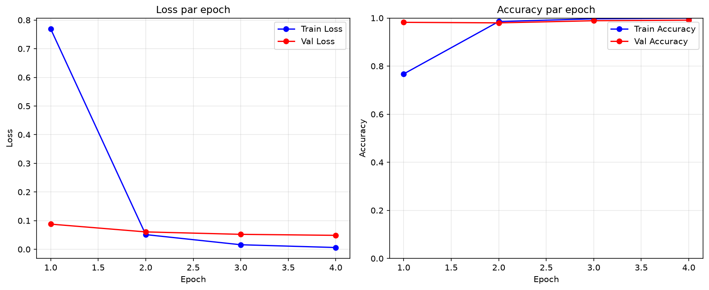
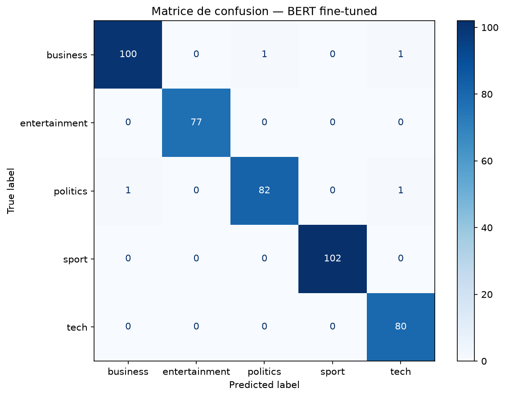
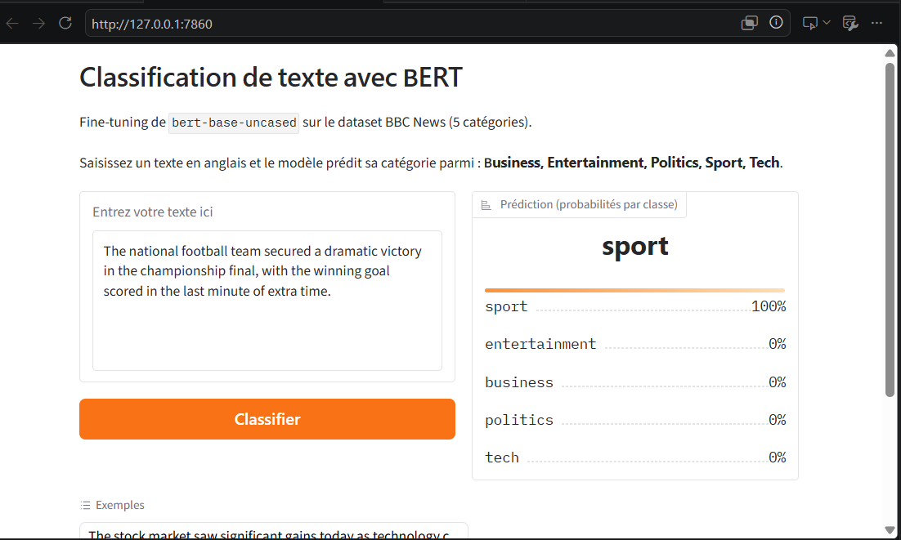

# bert-classification-bbcnews

**Devoir Pratique n°3 — NLP avec PyTorch : Fine-tuning de BERT**  
Master IA / Data Science — Deep Learning

> **Binôme :** Ghoulam NDIAYE & El Hadji Malick SAMB  
> **Dataset :** BBC News (5 catégories)

---

## 1. Présentation du Dataset

| Propriété | Valeur |
|-----------|--------|
| Source | BBC News Archive |
| Fichier | `data/bbc-news-data.csv` |
| Nb exemples | 2 225 |
| Nb classes | 5 |
| Langue | Anglais |

**Classes :** `business`, `entertainment`, `politics`, `sport`, `tech`

**Distribution :**
```
sport           511
business        510
politics        417
tech            401
entertainment   386
```
Déséquilibre max ≈ 1.32:1 (< 2:1) → pas de stratégie spéciale nécessaire, le split stratifié suffit.

**Longueur des textes (en mots) :** min=84 | moyenne=379 | max=4 428  
→ `max_length=256` choisi : couvre ~95% des textes sans exploser la VRAM.

---

## 2. Architecture & Choix Techniques

| Paramètre | Valeur | Justification |
|-----------|--------|---------------|
| Modèle | `bert-base-uncased` | Dataset anglais, taille raisonnable |
| Tokenizer | WordPiece (idem) | Fourni avec le modèle |
| Tête de classif. | Linear(768 → 5) | Ajoutée par `BertForSequenceClassification` |
| `max_length` | 256 | Couvre 95% des textes BBC |
| `batch_size` | 16 | Compatible GPU 8 GB |
| `num_epochs` | 4 | BERT converge vite, évite l'overfitting |
| Learning rate | 3e-5 | Zone recommandée (2e-5 – 5e-5) |
| Optimiseur | AdamW (wd=0.01) | Standard pour BERT |
| Scheduler | Warmup linéaire 10% | Stabilise le début de l'entraînement |
| Loss | CrossEntropyLoss | Classification multi-classes |
| Seed | 42 | Reproductibilité |

---

## 3. Structure du Projet

```
bert-classification-bbcnews/
├── data/
│   └── bbc-news-data.csv
├── dataset.py          # TextClassificationDataset (tokenization + padding)
├── model.py            # Chargement BERT et tokenizer
├── train.py            # Boucles train_epoch / eval_epoch + main
├── demo.py             # Interface Gradio interactive
├── utils.py            # fix_seed, compute_metrics, plot_curves, plot_confusion
├── requirements.txt
└── README.md
```

---

## 4. Installation & Exécution

### Prérequis

- Python 3.9+
- GPU recommandé (Google Colab accepté) — fonctionne aussi sur CPU (plus lent)

---

### Étape 1 — Cloner le dépôt

```bash
git clone https://github.com/<votre-user>/bert-classification-bbcnews.git
cd bert-classification-bbcnews
```

---

### Étape 2 — Créer et activer l'environnement virtuel

**Sur Windows :**
```bash
python -m venv venv
venv\Scripts\activate
```

**Sur Linux / macOS :**
```bash
python3 -m venv venv
source venv/bin/activate
```

**Sur Google Colab** (pas d'env virtuel nécessaire) :
```bash
!pip install -r requirements.txt
```

> Pour désactiver l'environnement virtuel à la fin : `deactivate`

---

### Étape 3 — Installer les dépendances

```bash
pip install -r requirements.txt
```

---

### Étape 4 — Vérifier la configuration

Avant de lancer l'entraînement, ouvrez `train.py` et vérifiez la **section CONFIG** :

```python
DATA_PATH  = "data/bbc-news-data.csv"  # chemin vers votre CSV
TEXT_COL   = "content"                  # colonne texte  (ex. "case_text")
LABEL_COL  = "category"                # colonne label  (ex. "case_outcome")
SEP        = "\t"                       # séparateur du CSV
MODEL_NAME = "bert-base-uncased"        # modèle HuggingFace
```

---

### Étape 5 — Lancer l'entraînement

```bash
python train.py
```

Fichiers générés après l'entraînement :
```
checkpoints/
├── best_model.pt          # Meilleur modèle (sauvegardé sur val_loss minimale)
├── training_curves.png    # Courbes loss / accuracy
└── confusion_matrix.png   # Matrice de confusion
label_map.json             # Mapping classes ↔ indices (requis par demo.py)
```

---

### Étape 6 — Lancer la démo Gradio

```bash
python demo.py
```

Ouvre automatiquement **http://localhost:7860** dans votre navigateur.  
Pour générer un lien public (utile sur Colab), modifier dans `demo.py` :
```python
interface.launch(share=True)  # génère un lien https://xxxxx.gradio.live
```

---

### Résumé des commandes (copier-coller)

```bash
# 1. Cloner
git clone https://github.com/<votre-user>/bert-classification-bbcnews.git
cd bert-classification-bbcnews

# 2. Environnement virtuel
python -m venv venv
venv\Scripts\activate          # Windows
# source venv/bin/activate     # Linux / macOS

# 3. Dépendances
pip install -r requirements.txt

# 4. Entraînement
python train.py

# 5. Démo
python demo.py
```

---

## 5. Résultats

> *(À compléter après l'entraînement)*

| Métrique | Valeur |
|----------|--------|
| Val Accuracy | 0.99101 |
| Val F1 (macro) | 0.99098 |
| Best val_loss | 0.04871 |

**Courbes d'apprentissage :**  


**Matrice de confusion :**  


---

## 6. Démo Gradio

> 

---

## 7. Répartition du Travail

| Tâche | Responsable |
|-------|-------------|
| `dataset.py` + `model.py` |  Ghoulam NDIAYE |
| `train.py` + `utils.py` | El Hadji Malick SAMB & Ghoulam NDIAYE |
| `demo.py` + README | El Hadji Malick SAMB & Ghoulam NDIAYE |

---

## 8. Difficultés Rencontrées

### Installation CUDA et PyTorch
- **Problème :** PyTorch installé en version CPU-only malgré la présence d'une GPU NVIDIA.
- **Solution :** Réinstaller PyTorch avec support CUDA : 
  ```bash
  pip install --upgrade torch torchvision torchaudio --index-url https://download.pytorch.org/whl/cu124
  ```

### Gestion des chemins de fichiers
- **Problème :** Les chemins absolus Windows causaient des erreurs lors du déplacement du projet ou du changement de répertoire de travail.
- **Solution :** Utiliser des chemins relatifs au script (`os.path.abspath(__file__)`) dans `demo.py` et `train.py` pour plus de portabilité.

### Choix de `max_length`
- **Problème :** Un `max_length` trop petit (128) aurait tronqué ~20% des articles BBC (moyenne 379 mots).
- **Analyse :** Avec `max_length=256`, ~95% des textes sont couverts sans exploser la VRAM sur GPU 4GB.
- **Décision :** Prioriser la couverture sémantique sur la VRAM, acceptable pour batch_size=16.

### Déséquilibre des classes
- **Observation :** Sport (511 ex.) vs Entertainment (386 ex.) = ratio 1.32:1.
- **Décision :** Split stratifié suffisant ; pas besoin de sur-échantillonnage ni class weights.

### Convergence et overfitting
- **Approche :** BERT converge rapidement (4 epochs suffit).
- **Safeguard :** Scheduler avec warmup linéaire (10%) + LR faible (3e-5) pour stabiliser le fine-tuning.

---

## Références

- [HuggingFace Transformers](https://huggingface.co/docs/transformers)
- [PyTorch Documentation](https://pytorch.org/docs)
- [Gradio](https://www.gradio.app/)
- BERT: [Devlin et al., 2018](https://arxiv.org/abs/1810.04805)
